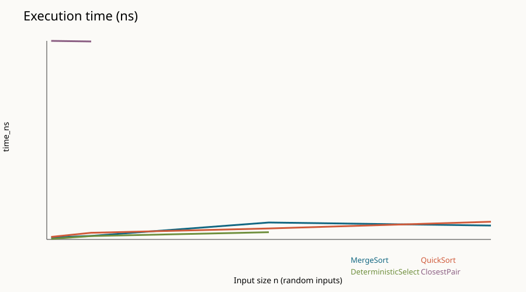
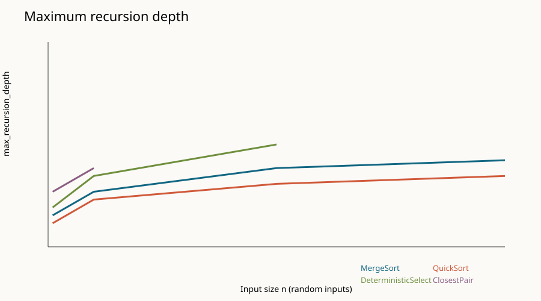

# Assignment 1: Divide-and-Conquer Algorithm Analysis

## Project Overview

This project implements and measures four classic divide-and-conquer algorithms in Java:

- `MergeSorter`: stable merge sort with one reusable auxiliary buffer and an insertion-sort cutoff.
- `QuickSorter`: randomized in-place quicksort with smaller-partition recursion and larger-partition iteration.
- `DeterministicSelector`: median-of-medians selection using groups of five.
- `ClosestPairSolver`: recursive closest pair of points with a y-ordered strip.

The project uses Java 17 source compatibility, Maven, JUnit 5, `System.nanoTime()`, and CSV output. The code is intentionally small and readable for an introductory DAA assignment.

## Repository Structure

```text
assignment1-divide-and-conquer/
├── src/main/java/assignment/
│   ├── MergeSorter.java
│   ├── QuickSorter.java
│   ├── DeterministicSelector.java
│   ├── ClosestPairSolver.java
│   ├── Experiment.java
│   ├── Point.java
│   ├── Metrics.java
│   └── Main.java
├── src/test/java/assignment/
├── docs/screenshots/
├── docs/plots/
├── results/results.csv
├── pom.xml
└── README.md
```

## Build, Test, and Run

Prerequisites: JDK 17 or newer and Maven 3.9 or newer.

```text
mvn clean test
mvn package
java -cp target/classes assignment.Main
```

The program creates `results/results.csv`, `results/time-vs-n.svg`, and `results/recursion-depth-vs-n.svg`. The Maven test suite contains 14 tests, including the required 100 randomized deterministic-select checks.

## Algorithm Analysis

### MergeSort

The array is divided into two halves, recursively sorted, and merged in linear time. Small ranges use insertion sort, and every recursive call reuses the same auxiliary buffer.

- Recurrence: $T(n) = 2T(n/2) + \Theta(n)$.
- Master Theorem: $a=2$, $b=2$, and $f(n)=\Theta(n)$, so $T(n)=\Theta(n\log n)$.
- Space: $\Theta(n)$ for the reusable buffer, plus $\Theta(\log n)$ call-stack depth.

### QuickSort

A random element is selected as pivot, then the array is partitioned in place. Only the smaller partition is recursed into; the larger partition is processed by the loop.

- Expected recurrence: $T(n)=2T(n/2)+\Theta(n)$, giving expected $\Theta(n\log n)$.
- Worst case: $T(n)=T(n-1)+\Theta(n)=\Theta(n^2)$.
- Space: $\Theta(\log n)$ stack depth because smaller-first recursion bounds active recursive calls.

### Deterministic Select

The input is divided into groups of five. Each group is sorted, the medians are collected, and the median of those medians becomes the pivot. Only the partition containing rank $k$ is processed next.

- Intuition: the pivot discards a constant fraction of the input at every level.
- Recurrence: $T(n) \leq T(n/5)+T(7n/10)+\Theta(n)$.
- Akra-Bazzi intuition: the linear partitioning work dominates the shrinking recursive subproblems, so $T(n)=\Theta(n)$.
- Space: $\Theta(\log n)$ recursion depth in this implementation.

### Closest Pair

Points are sorted by x-coordinate, then divided into left and right halves. The closest result from each side is combined by checking only the narrow strip around the dividing line in y-order.

- Recurrence: $T(n)=2T(n/2)+\Theta(n)$.
- Master Theorem: $T(n)=\Theta(n\log n)$.
- Space: $\Theta(n)$ for temporary y-order arrays and $\Theta(\log n)$ recursion depth.

## Experimental Results

The experiment uses `n = 100, 1,000, 5,000, 10,000` for sorting, random/sorted/reverse-sorted/duplicate-heavy inputs, and smaller inputs for selection and closest-pair measurements. Each row records elapsed nanoseconds, maximum recursion depth, comparisons, swaps, and recursive calls.

Example random-input measurements from `results/results.csv`:

| Algorithm | n=100 time (ns) | n=1,000 time (ns) | n=5,000 time (ns) | n=10,000 time (ns) |
|---|---:|---:|---:|---:|
| MergeSort | 494,800 | 917,500 | 4,361,700 | 3,578,600 |
| QuickSort | 661,900 | 1,709,800 | 2,824,200 | 4,553,700 |
| Deterministic Select | 153,700 | 876,900 | 1,858,200 | not measured |
| Closest Pair | 51,116,900 | 50,960,000 | not measured | not measured |

The timing values are illustrative single-run measurements, so JVM warm-up and machine load can change them. Operation counts and recursion depth are more stable indicators for comparing growth.

### Plots





Readable generated output and test-result assets are in `docs/screenshots/`.

## Discussion

The operation counts and recursion-depth plots follow the expected patterns: merge sort grows close to $n\log n$, selection grows linearly, and closest pair has logarithmic recursion depth with linear work at each level. Timing is noisier because the JVM, JIT compilation, garbage collection, cache behavior, and operating-system scheduling affect short runs.

Input structure changes practical performance. Merge sort is relatively predictable, while quicksort can do more work on ordered or duplicate-heavy data even with a randomized pivot. Recursing on the smaller quicksort partition keeps the active stack logarithmic; the larger side is handled by iteration. Median-of-medians guarantees progress because groups of five ensure that a fixed fraction of elements is no larger than, and no smaller than, the chosen pivot. Closest pair avoids checking every pair: after solving both halves, the y-ordered strip needs only a constant number of nearby comparisons per point, which is much faster than $O(n^2)$ for large datasets.

## Reflection

This assignment made the difference between an asymptotic guarantee and a measured runtime clearer. The most useful implementation detail was tracking metrics inside the recursive methods instead of trying to infer them from elapsed time. Reusing the merge buffer also showed how a small memory decision can remove repeated allocations.

The main challenge was handling edge cases without weakening the algorithm: empty and single-element arrays, duplicate values, duplicate point coordinates, and rank validation. The closest-pair split especially needs to preserve exactly the left and right halves when x-coordinates are equal. Testing against simple reference implementations made that issue visible and gave confidence in the final result.

## Screenshots and GitHub Workflow

The repository includes generated SVG report assets under `docs/plots/` and output/test-result assets under `docs/screenshots/`. Suggested development commits are:

```text
init: project structure and tests
feat(mergesort): implement merge sort
feat(quicksort): implement randomized quicksort
feat(select): implement median-of-medians
feat(closest): implement closest pair
feat(metrics): add performance measurements
feat(testing): add correctness tests
docs(report): add analysis and plots
fix: handle edge cases
release: v1.0
```
